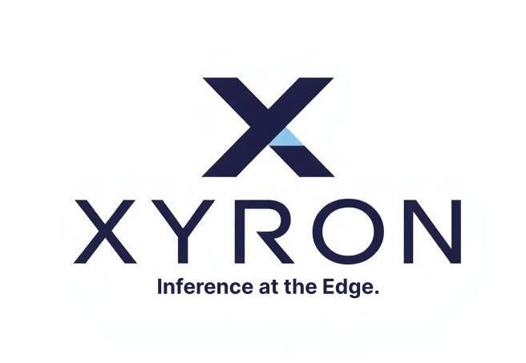

<p align="center">
  
</p>


# Xyron

> **Neural networks for microcontrollers that were never meant to run them.**

Xyron is a command-line tool that trains a neural network on your desktop and exports a single, self-contained C header file — ready to drop into any embedded project. 

**No runtime. No framework. No TensorFlow Lite. Just pure C and a microcontroller.**

---

### ⚡ The Proof
> *"I ran MNIST on an ESP32-C3 — no TensorFlow, no TFLite, no ML runtime of any kind."*
> → [Read the full writeup on dev.to](https://dev.to/alexrosito67/i-ran-mnist-on-an-esp32-c3-without-tensorflow-tflite-or-any-ml-runtime-1cjk)

---

## How it works

1. Train your model on your desktop using Xyron
2. Xyron exports a `.h` file containing the trained weights and a ready-to-call `predict()` function
3. Drop the header into your embedded project and call it from your main loop

```c
#include "model.h"

float input[2] = { 1.0f, 0.0f };
float output[1];

predict(input, output);
// output[0] → 0.987
```

No heap allocation. No dependencies. No runtime overhead. If it compiles for your target, it runs.

---

## Who is this for

- Embedded developers who need inference on MCUs with no room for TensorFlow Lite
- Engineers prototyping edge AI on cheap, widely available hardware
- Anyone who needs a trained model deployed as a single C header

---

## Free vs Pro

| Feature | Free | Pro |
|---|---|---|
| Hidden layers | Max 2 | Unlimited |
| Neurons per layer | Max 64 | Unlimited |
| Batch processing | — | ✅ |
| Quantization | Float (FP32) | Float (FP32) - INT8 - INT4 |
| Commercial use | Personal / Educational | ✅ |
| License | Free (non-commercial) | Commercial license |

The Free version is fully functional for learning, prototyping, and non-commercial projects.  
When your model outgrows two layers or you need INT8 quantization to fit tighter memory constraints — [Xyron Pro is available here](#).

---

## Quick start

Download the binary for your platform from the [latest release](https://github.com/AlexRosito67/xyron/releases/latest):

| Platform | Binary |
|---|---|
| Linux | `xyron_free_linux` |
| Windows | `xyron_free_windows.exe` |
| macOS | `xyron_free_macos` |

Make the binary executable and add it to your `PATH`.

### Train an XOR classifier

```bash
xyron -d 2,4,1 \
    -act sigmoid,sigmoid \
    -e 500 \
    -l 0.1 \
    -f examples/xor.csv \
    -o xor_model.txt

Starting fresh training (random initialization)

[Small dataset (4 samples < 10): using full data for training and validation]
  Train samples: 4
  Val samples:   4 (same as train)
Epoch:   0 | Train Loss: 0.25230047 | Train Acc: 0.5000 | Val Loss: 0.25230047 | Val Acc: 0.5000
Epoch:  50 | Train Loss: 0.24942766 | Train Acc: 0.5000 | Val Loss: 0.24942766 | Val Acc: 0.5000
Epoch: 100 | Train Loss: 0.24153768 | Train Acc: 0.7500 | Val Loss: 0.24153768 | Val Acc: 0.7500
Epoch: 150 | Train Loss: 0.21943285 | Train Acc: 0.7500 | Val Loss: 0.21943285 | Val Acc: 0.7500
Epoch: 200 | Train Loss: 0.17690438 | Train Acc: 0.7500 | Val Loss: 0.17690438 | Val Acc: 0.7500
Epoch: 250 | Train Loss: 0.11985774 | Train Acc: 1.0000 | Val Loss: 0.11985774 | Val Acc: 1.0000
Epoch: 300 | Train Loss: 0.07352899 | Train Acc: 1.0000 | Val Loss: 0.07352899 | Val Acc: 1.0000
Epoch: 350 | Train Loss: 0.04729503 | Train Acc: 1.0000 | Val Loss: 0.04729503 | Val Acc: 1.0000
Epoch: 400 | Train Loss: 0.03239918 | Train Acc: 1.0000 | Val Loss: 0.03239918 | Val Acc: 1.0000
Epoch: 450 | Train Loss: 0.02357922 | Train Acc: 1.0000 | Val Loss: 0.02357922 | Val Acc: 1.0000
Epoch: 499 | Train Loss: 0.01802613 | Train Acc: 1.0000 | Val Loss: 0.01802613 | Val Acc: 1.0000

=== Training Complete === (Final Val Loss: 0.018026)

Model saved to: xor_model.txt
```

### Run inference

```bash
xyron -d 2,4,1 -act sigmoid,sigmoid -a predict -m xor_model.txt -v "1.0,0.0"
```

### Export to C header

```bash
xyron -d 2,4,1 -act sigmoid,sigmoid -a export -m xor_model.txt -o model.h -q float
```

---

## Examples included

- `examples/xor.csv` — binary classification, the classic smoke test
- `examples/regression_1d.csv` — simple 1D regression
- `examples/softmax_toy.csv` — multiclass classification

---

## Real-world deployment

Xyron was used to train and deploy a neural network on an **ESP32-C3** — one of the smallest, cheapest MCUs available — running MNIST digit classification with no ML runtime whatsoever.

→ [Full project and source code](https://github.com/AlexRosito67/xyron-mnist-esp32)  
→ [dev.to writeup](https://dev.to/alexrosito67/i-ran-mnist-on-an-esp32-c3-without-tensorflow-tflite-or-any-ml-runtime-1cjk)

---

## License

Xyron Free is provided free of charge for personal and educational use under the [Xyron Free License](LICENSE).

By using Xyron Free you agree to its terms. Key conditions:

- **Permitted:** personal projects, academic research, education, evaluation
- **Not permitted:** commercial use of the Software or its Output (exported C headers, model files)
- **Redistribution:** allowed free of charge, in unmodified form, with this license included
- **Modification:** not permitted — Xyron Free is not open source

If your project grows into a commercial product, or you need to embed Xyron-generated headers in commercial firmware, a Xyron Pro commercial license is required.

Contact: xyron.io@protonmail.com

---

*Built for the microcontrollers at the bottom of the drawer — still useful, still available, still cheap.*
